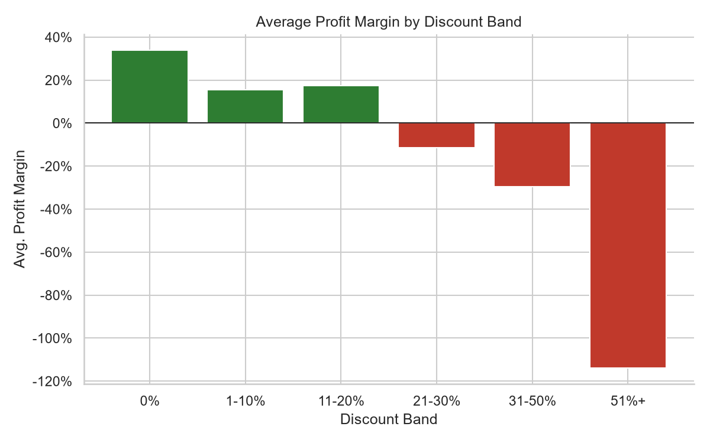
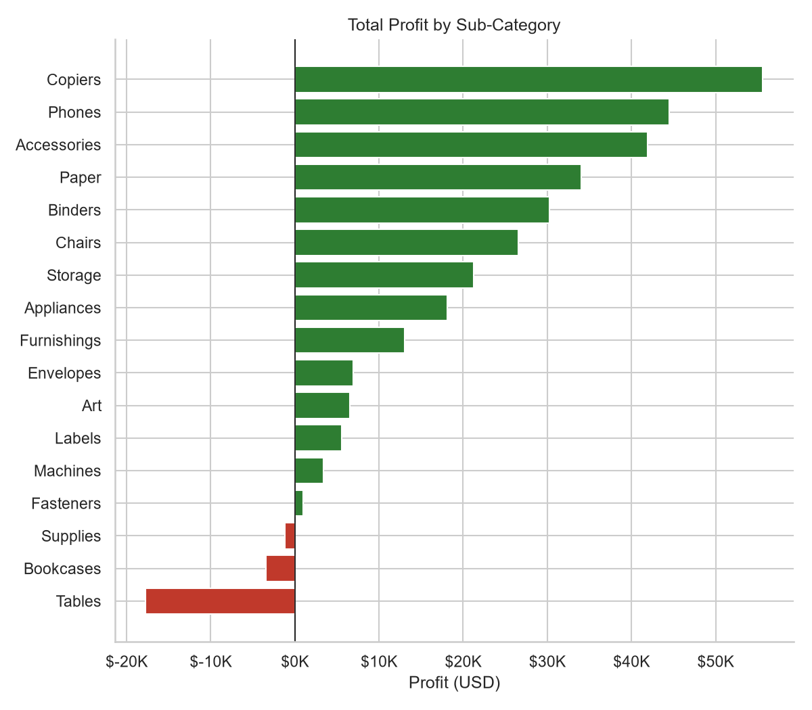

# Superstore Sales & Profitability Analysis

A data analysis project on the classic **Sample Superstore** dataset (Kaggle) — 9,994 US retail orders from 2015–2018 — built to answer one question a business stakeholder actually cares about:

> **Where is this company making money, where is it quietly losing money, and what should leadership do about it?**

🔗 **[Live interactive dashboard](https://vismayaramesh18.github.io/superstore-sales-analysis/)** — filter by year/region and explore the charts yourself.
📓 **[Read the full notebook](notebooks/superstore_sales_analysis.ipynb)** — data quality checks, SQL analysis, charts, and recommendations, in that order.

## Why this project

Coming from 4+ years working with SAP HANA data models (Calculation Views, SQLScript, production data quality), this project is deliberately structured the way I'd approach a reporting request in that world: validate the data before trusting it, do the core aggregation/ranking logic in SQL, then layer visual analysis and business recommendations on top.

## Key findings

| Finding | Detail |
|---|---|
| **A few sub-categories are quietly loss-making** | Tables lose **$17.7K** on $207K of sales (-8.6% margin); Bookcases and Supplies are also net-negative. |
| **There's a discount cliff at ~20%** | Average profit margin holds up to a 20% discount, then turns negative and keeps falling — discounts above 50% are sold at roughly a **-113% margin**. |
| **Central region underperforms structurally** | Central converts sales to profit at **7.9%** margin vs. **14.9%** in the West — despite doing more revenue than the South. |
| **~20% of customers are net loss-making** | 155 of 793 customers have negative lifetime profit, some by several thousand dollars. |
| **Sales are strongly seasonal** | Every November–December sees a 2-3x spike over slow months like February, consistently across all four years. |

See the [notebook's recommendations section](notebooks/superstore_sales_analysis.ipynb#5-business-insights--recommendations) for what to do about each of these.

## The discount cliff



## Profit by sub-category



## What's in the notebook

1. **Data loading & quality checks** — the raw CSV export includes 806 structurally broken trailing rows from a source workbook artifact; they're identified, root-caused, and dropped before any KPI is computed.
2. **SQL-based analysis** (SQLite) — the same patterns used against HANA calculation views: `GROUP BY` aggregation, `RANK() OVER (PARTITION BY ...)` for top-N-per-region reporting, a `CTE` with a running-total window function for the monthly trend, and a `HAVING`-based exception report for loss-making customers.
3. **Exploratory & visual analysis** — category/sub-category profitability, the discount-vs-margin relationship, a region × category profit heatmap, monthly seasonality, and customer segment performance.
4. **Business insights & recommendations** — each finding translated into a concrete, actionable recommendation.

## Tech stack

- **Python** — pandas, NumPy
- **SQL** — SQLite (window functions, CTEs)
- **Visualization** — matplotlib, seaborn
- **Jupyter** notebook

## Running it locally

```bash
pip install -r requirements.txt
jupyter notebook notebooks/superstore_sales_analysis.ipynb
```

## Data source

[Sample Superstore dataset](https://www.kaggle.com/datasets/vivek468/superstore-dataset-final) on Kaggle — a widely-used sample retail dataset (originally distributed with Tableau) covering orders, products, customers, and shipping across the US, 2015–2018.

## Project structure

```
.
├── data/
│   └── Sample-Superstore.csv        # raw dataset
├── notebooks/
│   └── superstore_sales_analysis.ipynb   # full analysis, executed with outputs
├── images/                          # exported chart images (used in this README)
├── docs/                            # interactive dashboard, served via GitHub Pages
│   ├── index.html
│   ├── app.js
│   └── data.json
├── requirements.txt
└── README.md
```
